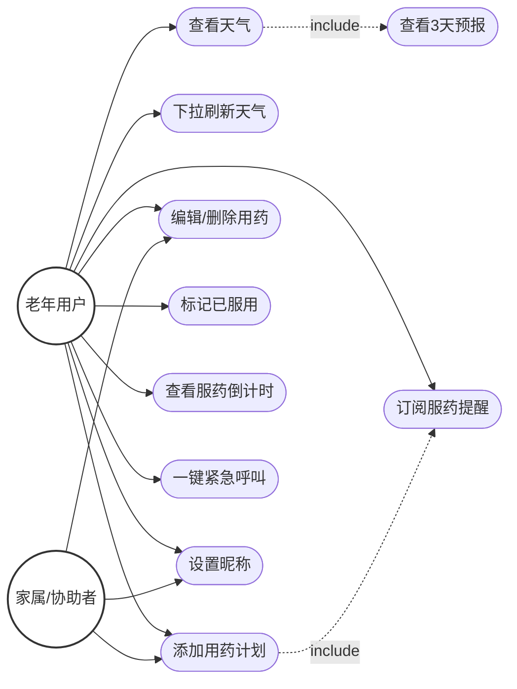

# 《暖伴》软件需求规格说明书

## 1. 引言

### 1.1 编写目的
本文档用于描述"暖伴"微信小程序已实现的功能需求、用户场景及非功能性需求，作为开发验收和功能维护的基线文档。

### 1.2 项目背景
"暖伴"是一款面向60岁以上老年人的极简工具类微信小程序，名称寓意"温暖的陪伴"。当前社会老龄化加剧，许多老年人需要简单的数字化工具辅助日常生活。市面上的应用往往功能繁杂、字体过小、操作复杂，不适合老年人使用。本项目聚焦老年人最高频的两个需求——**查看天气**和**用药提醒**，以大字体、极简交互、清晰视觉为设计原则，打造真正适老的小程序。

### 1.3 术语定义

| 术语 | 说明 |
|------|------|
| 云开发 | 微信提供的一站式后端云服务，包含云函数、云数据库、云存储 |
| 云函数 | 运行在云端的代码，前端通过调用云函数间接访问外部API或数据库 |
| 订阅消息 | 微信小程序的一种消息推送机制，用户授权后可在特定场景接收通知 |
| 心知天气 | 第三方天气数据服务提供商，本项目使用其免费版API |
| OPENID | 微信用户的唯一标识，用于云数据库中的数据隔离 |

### 1.4 参考资料
- 微信小程序官方开发文档
- 心知天气API文档（https://www.seniverse.com/）
- 微信云开发文档

---

## 2. 总体描述

### 2.1 产品定位与价值
- **产品名称**：暖伴（小程序端显示名称：暖阳叮嘱）
- **目标用户**：60岁以上老年人，以及帮助老年人管理用药的家属
- **核心价值**：
  - 让老年人无需复杂操作即可查看当地天气和穿衣建议
  - 帮助老年人建立规律的用药习惯，避免漏服、错服
  - 提供紧急情况下的一键求助入口
- **产品特色**：大字体、高对比度、极简交互、零学习成本

### 2.2 用户角色（Actor）

| 角色 | 描述 | 使用频率 |
|------|------|---------|
| 老年用户 | 60岁以上，对智能设备操作不熟悉，视力可能退化，是核心使用群体 | 每日多次 |
| 家属/协助者 | 帮助老年人初始设置用药计划、教老年人使用小程序 | 偶尔 |

### 2.3 运行环境
- **客户端**：微信客户端（基础库版本 2.2.3+）
- **服务端**：微信云开发环境
- **网络**：需要网络连接获取天气数据和同步用药记录
- **定位**：需要用户授权获取位置信息以提供当地天气

### 2.4 假设与依赖
- 用户已安装微信并具备基本操作能力
- 微信云开发环境已开通并配置正确
- 心知天气API Key已申请并配置到云函数环境变量（未配置时自动降级为Mock数据）
- 订阅消息模板ID需在微信公众平台申请并替换代码中的占位符后，推送功能方可生效

---

## 3. 功能需求

### 3.1 功能模块划分

| 模块编号 | 模块名称 | 模块职责 |
|---------|---------|---------|
| M1 | 天气查询 | 获取用户定位，展示实况天气、未来3天预报、穿衣建议等生活指数 |
| M2 | 用药提醒 | 管理用药计划（增删改查），标记服药状态，服药倒计时提醒 |
| M3 | 紧急联系 | 提供一键拨打预设紧急电话的功能 |
| M4 | 用户设置 | 设置用户昵称，个性化展示 |
| M5 | 消息推送 | 通过订阅消息在服药时间推送提醒 |

### 3.2 用例图

### 3.3 用例描述

#### 3.3.1 M1 天气查询模块

**用例：UC-01 查看天气**

| 项目 | 描述 |
|------|------|
| 用例名称 | 查看天气 |
| 参与者 | 老年用户 |
| 前置条件 | 用户已打开小程序，天气页面为默认首页 |
| 主流程 | 1. 用户打开天气页面，页面显示日期和星期 2. 系统检查本地缓存（10分钟内有效），有则直接展示 3. 无缓存时获取用户定位（失败则降级为北京坐标） 4. 调用云函数getWeather获取实况天气和3天预报 5. 页面展示Hero卡片：当前温度、天气状况、温度范围、天气Emoji、位置 6. 展示未来3天预报列表（日期、天气Emoji、天气文字、温度范围） 7. 展示天气详情卡片：湿度、风力等级、紫外线强度 8. 展示温馨提示卡片：穿衣建议、运动建议、洗车建议 |
| 异常流程 | E1. 定位失败：使用默认位置（北京39.9042, 116.4074）获取天气 E2. API Key未配置：云函数返回Mock数据，页面正常展示模拟数据 E3. API调用失败：云函数返回Mock数据并附带错误信息 E4. 网络异常：展示缓存数据（若10分钟内有缓存）或默认提示"天气舒适，适合外出活动，注意补充水分。"，Toast提示"网络请求失败"或"定位失败" |
| 后置条件 | 天气数据缓存到本地Storage（key: weather_cache），包含weather、forecast、timestamp、isMock、weatherEmoji、tipText |

**用例：UC-02 下拉刷新天气**

| 项目 | 描述 |
|------|------|
| 用例名称 | 下拉刷新天气 |
| 参与者 | 老年用户 |
| 前置条件 | 用户位于天气页面 |
| 主流程 | 1. 用户下拉页面触发onPullDownRefresh 2. 设置loading状态为true 3. 清除本地天气缓存（wx.removeStorageSync） 4. 重新执行loadWeather流程 5. 停止下拉刷新动画 |
| 异常流程 | 同UC-01异常流程 |
| 后置条件 | 更新本地缓存 |

#### 3.3.2 M2 用药提醒模块

**用例：UC-03 添加用药计划**

| 项目 | 描述 |
|------|------|
| 用例名称 | 添加用药计划 |
| 参与者 | 老年用户、家属/协助者 |
| 前置条件 | 用户位于用药提醒页面 |
| 主流程 | 1. 用户点击"添加药物"按钮 2. 弹出添加弹窗，表单包含：药品名称（文本输入）、剂量说明（文本输入）、服药时间（时间选择器）、时段（下拉选择器） 3. 系统根据当前时间自动推荐时段（如上午9点推荐"早餐后"），时间默认为当前整点 4. 用户修改时间时，时段自动联动推荐 5. 用户点击"确定添加" 6. 系统校验药品名称非空 7. 系统校验同名同时间的记录不存在 8. 请求订阅消息授权（wx.requestSubscribeMessage） 9. 调用云函数saveMedication保存记录 10. 提示"添加成功"，刷新列表 |
| 异常流程 | E1. 药品名称为空：提示"请输入药品名称" E2. 同名同时间记录已存在：提示"该药品已存在相同时间记录" E3. 用户拒绝订阅授权：不影响添加药物，仅无法接收推送 E4. 网络异常：提示"添加失败" |
| 后置条件 | 用药列表更新，下次服药倒计时重新计算，订阅配额+1（若用户同意授权） |

**用例：UC-04 编辑用药记录**

| 项目 | 描述 |
|------|------|
| 用例名称 | 编辑用药记录 |
| 参与者 | 老年用户、家属/协助者 |
| 前置条件 | 用药列表中已有记录 |
| 主流程 | 1. 用户点击某条用药记录 2. 弹出操作菜单（编辑此药物 / 删除此药物 / 取消） 3. 选择"编辑此药物" 4. 进入编辑弹窗，表单回填原有数据（药品名称、剂量、时间、时段） 5. 用户修改后点击"保存修改" 6. 系统校验药品名称非空和重复（排除自身） 7. 调用云函数saveMedication(action: edit)更新记录 8. 提示"修改成功"，关闭弹窗，刷新列表 |
| 异常流程 | E1. 无权操作（OPENID不匹配）：提示"无权修改该记录" E2. 记录不存在：提示"药物记录不存在" E3. 同名同时间记录已存在：提示"该药品已存在相同时间记录" |
| 后置条件 | 列表更新，状态重新计算 |

**用例：UC-05 删除用药记录**

| 项目 | 描述 |
|------|------|
| 用例名称 | 删除用药记录 |
| 参与者 | 老年用户、家属/协助者 |
| 前置条件 | 用药列表中已有记录 |
| 主流程 | 1. 用户点击某条用药记录 2. 弹出操作菜单 3. 选择"删除此药物" 4. 弹出确认对话框："确定要删除「{药品名}」吗？" 5. 用户点击"确定" 6. 调用云函数saveMedication(action: delete)删除记录 7. 提示"已删除"，关闭操作菜单，刷新列表 |
| 异常流程 | E1. 无权操作（OPENID不匹配）：提示"无权删除该记录" E2. 记录不存在：提示"药物记录不存在" E3. 网络异常：提示"删除失败" |
| 后置条件 | 列表更新，倒计时重新计算 |

**用例：UC-06 标记服药状态**

| 项目 | 描述 |
|------|------|
| 用例名称 | 标记服药状态 |
| 参与者 | 老年用户 |
| 前置条件 | 用药列表中存在今日记录 |
| 主流程 | 1. 用户点击记录左侧的复选框（catchtap阻止冒泡） 2. 系统判断当前状态：若今日已服用则切换为"未服用"，若未服用则切换为"已服用" 3. 调用云函数saveMedication(action: update)更新status和takenAt 4. 若标记为已服用，请求订阅消息授权（为下次提醒补充配额） 5. 提示"已标记"或"已取消" 6. 刷新列表（已服用记录排到后面） |
| 异常流程 | E1. 操作失败：提示"操作失败" |
| 后置条件 | 列表重新排序，下次服药倒计时更新 |

**用例：UC-07 查看服药倒计时**

| 项目 | 描述 |
|------|------|
| 用例名称 | 查看服药倒计时 |
| 参与者 | 老年用户 |
| 前置条件 | 用户位于用药提醒页面 |
| 主流程 | 1. 页面顶部展示"下一次服药时间"卡片 2. 卡片显示：目标药品时间、倒计时文案（如"还有2小时30分钟"） 3. 倒计时每30秒自动更新（setInterval） 4. 倒计时小于1小时时（仅含分钟），高亮显示为紧急状态（CSS类urgent） 5. 时间已过且未服用：显示"已过服药时间" 6. 所有药品已服用：显示"已完成 - 今日所有用药已完成" 7. 无用药计划：显示"--:-- - 还没有添加用药计划" |
| 异常流程 | 无 |
| 后置条件 | 页面隐藏/卸载时清除定时器 |

**用例：UC-08 查看用药列表**

| 项目 | 描述 |
|------|------|
| 用例名称 | 查看用药列表 |
| 参与者 | 老年用户 |
| 前置条件 | 用户位于用药提醒页面 |
| 主流程 | 1. 页面加载/显示时调用云函数获取用药列表 2. 每条记录显示：复选框、时段标签、服药时间、状态徽章（已服用/待服用/未到时间）、药品名称、剂量 3. 排序规则：未服用在前（按时间升序），已服用在后（按时间升序） 4. 页面底部展示用药小贴士："请按时按量服药，如有不适，请咨询医生。" |
| 异常流程 | E1. 获取失败：提示"获取用药列表失败" E2. 列表为空：展示空状态（💊图标 + "还没有用药计划" + "点击下方按钮添加药物"） |
| 后置条件 | 无 |

#### 3.3.3 M3 紧急联系模块

**用例：UC-09 一键紧急呼叫**

| 项目 | 描述 |
|------|------|
| 用例名称 | 一键紧急呼叫 |
| 参与者 | 老年用户 |
| 前置条件 | 用户位于紧急联系页面 |
| 主流程 | 1. 页面展示紧急联系主卡片（电话图标 + 紧急联系电话号码 + 拨打提示） 2. 页面展示大拨号按钮"立即拨打" 3. 用户点击拨号按钮 4. 调用wx.makePhoneCall，系统弹出拨号确认对话框 5. 用户确认后拨打电话 6. 页面展示拨打提示卡片 |
| 异常流程 | E1. 用户取消拨号：提示"已取消拨号" |
| 后置条件 | 无 |

#### 3.3.4 M4 用户设置模块

**用例：UC-10 设置昵称**

| 项目 | 描述 |
|------|------|
| 用例名称 | 设置昵称 |
| 参与者 | 老年用户 |
| 前置条件 | 用户位于天气页面 |
| 主流程 | 1. 天气页面顶部显示用户栏（👋图标 + 昵称或"点击设置昵称" + 箭头） 2. 用户点击用户栏，跳转至设置页面 3. 页面回填已保存的昵称（若有） 4. 用户点击输入框，可选择微信昵称或手动输入（type="nickname"，最大20字符） 5. 点击"保存昵称" 6. 系统校验非空，保存到本地Storage（key: user_nickname） 7. 提示"已保存"，800ms后返回天气页面 8. 天气页面顶部显示更新后的昵称 |
| 异常流程 | E1. 昵称为空：提示"请输入昵称" |
| 后置条件 | 昵称保存到本地Storage |

**用例：UC-11 清除昵称**

| 项目 | 描述 |
|------|------|
| 用例名称 | 清除昵称 |
| 参与者 | 老年用户 |
| 前置条件 | 用户位于设置页面且已保存昵称 |
| 主流程 | 1. 页面底部展示"清除昵称"按钮（仅已有昵称时显示） 2. 用户点击"清除昵称" 3. 输入框清空（不立即删除Storage，需用户点击"保存昵称"确认） |
| 异常流程 | 无 |
| 后置条件 | 输入框内容清空 |

#### 3.3.5 M5 消息推送模块

**用例：UC-12 订阅服药提醒**

| 项目 | 描述 |
|------|------|
| 用例名称 | 订阅服药提醒 |
| 参与者 | 老年用户 |
| 前置条件 | 用户添加用药计划或标记已服用时 |
| 主流程 | 1. 用户添加用药计划时，自动调用wx.requestSubscribeMessage请求订阅授权 2. 用户标记已服用时，同样请求订阅授权（补充配额） 3. 用户同意授权后，调用云函数saveMedication(action: addSubscribe)为该用户所有pending状态的用药记录增加1次订阅配额 4. 云函数medicationReminder每5分钟定时触发（cron: 0 */5 * * * * *） 5. 查询所有subscribeCount > 0的用药记录 6. 跳过今日已服用的记录 7. 检查服药时间是否在当前时间±5分钟窗口内 8. 在窗口内则调用cloud.openapi.subscribeMessage.send发送提醒（含药品名称、时间、剂量、时段） 9. 发送成功后扣减subscribeCount |
| 异常流程 | E1. 用户拒绝授权：不影响添加药物操作，仅无法接收推送 E2. 发送失败：记录错误日志，不扣减配额 E3. 配额不足（subscribeCount=0）：不发送提醒 |
| 后置条件 | 用户在微信服务通知中收到服药提醒 |

---

## 4. 非功能需求

### 4.1 性能需求
- 天气数据本地缓存有效期10分钟，缓存命中时直接展示，避免API调用
- 云函数HTTPS请求超时时间10秒
- 服药倒计时每30秒更新一次（setInterval 30000ms）
- 天气页面用户栏昵称从本地Storage读取（同步读取，无延迟）

### 4.2 可用性需求（适老设计）
- **字体大小**：全局基础字号24px，用户昵称48rpx，天气温度大字号展示，满足老年人阅读需求
- **颜色方案**：蓝色主题（主色#3A7BD5），Hero卡片蓝渐变（#7EC8FC → #4A90D9），白色背景高对比度
- **交互简化**：天气页面无操作即自动加载，用药操作通过大按钮+弹窗完成，紧急联系一键拨打
- **操作反馈**：所有操作都有Toast提示（成功用success图标，失败用none图标）
- **信息层级**：Hero卡片突出温度，详情卡片横排三列，温馨提示黄底卡片区分信息层级
- **空状态引导**：用药列表为空时展示引导图标和文字提示

### 4.3 安全需求
- 心知天气API Key存储在云函数环境变量（SENIVERSE_KEY），前端无法访问
- 用药数据按OPENID隔离，编辑/删除操作校验记录的_openid与当前用户匹配
- 云数据库medications集合权限设置为"仅创建者可读写"

### 4.4 兼容性需求
- 微信小程序基础库版本要求：2.2.3+（云能力最低版本）
- 自定义导航栏组件适配不同机型状态栏高度和胶囊按钮位置（通过wx.getMenuButtonBoundingClientRect计算）
- 自定义TabBar适配不同屏幕底部安全区域（env(safe-area-inset-bottom)）
- 组件按需注入已启用（app.json中配置"lazyCodeLoading": "requiredComponents"）

---

## 5. 外部接口需求

### 5.1 第三方接口

| 接口名称 | 对接系统 | 交互方式 | 说明 |
|---------|---------|---------|------|
| 实况天气查询 | 心知天气API | HTTPS GET /weather/now.json | 获取当前温度、天气状况、体感温度、湿度、风力、风方向 |
| 3天天气预报 | 心知天气API | HTTPS GET /weather/daily.json | 获取未来3天预报（白天天气、夜间天气、最高温、最低温） |

### 5.2 微信原生能力

| 接口名称 | 能力说明 | 使用场景 |
|---------|---------|---------|
| wx.getLocation | 获取用户地理位置（wgs84） | 天气查询定位 |
| wx.getSetting | 获取用户授权状态 | 检查定位权限 |
| wx.openSetting | 跳转设置页引导授权 | 定位权限被拒后引导 |
| wx.cloud.callFunction | 调用云函数 | 天气查询、用药数据CRUD、订阅配额管理 |
| wx.requestSubscribeMessage | 订阅消息授权 | 添加药物时、标记已服用时 |
| wx.makePhoneCall | 拨打电话 | 紧急联系 |
| wx.setStorageSync / getStorageSync / removeStorageSync | 本地存储 | 缓存天气数据、保存/读取昵称 |
| wx.showToast | 轻提示 | 操作反馈 |
| wx.showModal | 模态对话框 | 删除确认、定位权限引导 |
| wx.getSystemInfoSync | 获取系统信息 | 计算导航栏高度 |
| wx.getMenuButtonBoundingClientRect | 获取胶囊按钮位置 | 计算自定义导航栏高度 |
| cloud.openapi.subscribeMessage.send | 发送订阅消息 | 云函数定时推送服药提醒 |

### 5.3 云开发资源

| 资源类型 | 资源名称 | 说明 |
|---------|---------|------|
| 云函数 | getWeather | 调用心知天气API，返回实况天气+3天预报+穿衣建议+紫外线+运动指数+洗车指数；无API Key时返回Mock数据 |
| 云函数 | saveMedication | 用药数据CRUD（list/add/update/edit/delete/addSubscribe），按OPENID隔离 |
| 云函数 | medicationReminder | 每5分钟定时触发，检查服药时间窗口并发送订阅消息提醒，发送后扣减配额 |
| 云数据库集合 | medications | 存储用药记录，字段：_openid, name, dosage, time, periodLabel, status, takenAt, createdAt, subscribeCount |
| 定时触发器 | medicationReminder的every5Minutes | cron: "0 */5 * * * * *"，每5分钟触发一次 |

### 5.4 本地计算的生活指数

生活指数不调用付费API，在云函数getWeather中根据天气数据本地计算：

| 指数名称 | 计算依据 | 输出示例 |
|---------|---------|---------|
| 穿衣建议 | 根据当前温度分段（≥30°/≥20°/≥10°/≥0°/<0°） | "天气微凉，建议穿外套或夹克。" |
| 紫外线强度 | 根据天气状况文字估算（晴→强，多云→中等，阴/雨→弱） | "中等" |
| 运动指数 | 根据天气状况和温度估算（雨雪→不宜，≥35°→不宜，20-30°→非常适宜） | "较适宜" |
| 洗车指数 | 根据天气状况估算（雨雪→不宜，尘雾→不太适宜，其他→适宜） | "适宜" |

---

## 6. 约束与假设

### 6.1 技术约束
- 使用微信小程序原生开发框架，不使用Taro、uni-app等跨端框架
- 后端使用微信云开发，不独立部署服务器
- 天气API仅使用心知天气免费版接口（/weather/now.json 和 /weather/daily.json）
- 生活指数（穿衣建议、紫外线、运动、洗车）通过云函数本地计算生成，不调用付费接口
- 小程序已启用组件按需注入（app.json中配置"lazyCodeLoading": "requiredComponents"）

### 6.2 业务约束
- 订阅消息需用户在每次添加药物/标记已服用时重新授权（微信小程序限制，每次授权仅1次配额）
- 免费版心知天气API有调用次数限制，通过10分钟本地缓存控制调用频率
- 紧急联系号码为代码中硬编码的固定号码（当前值：13943145637），不支持用户自定义
- 订阅消息模板ID需替换代码中的`your-template-id`占位符后方可生效（涉及文件：miniprogram/pages/medication/index.js、cloudfunctions/medicationReminder/index.js）
- 心知天气API Key需在云开发控制台配置环境变量SENIVERSE_KEY，未配置时云函数返回Mock数据
